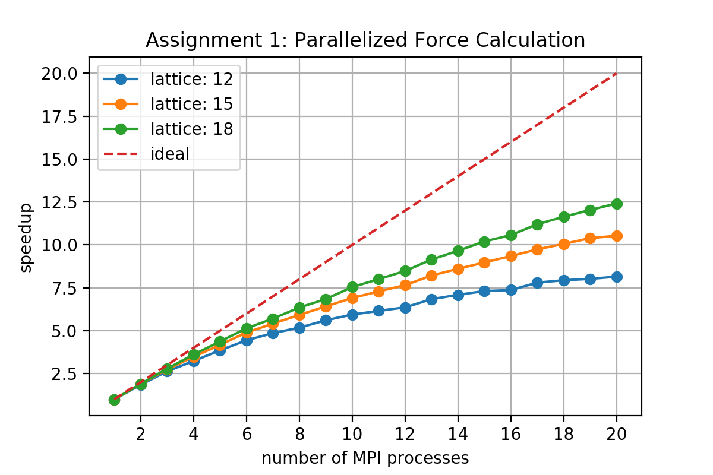
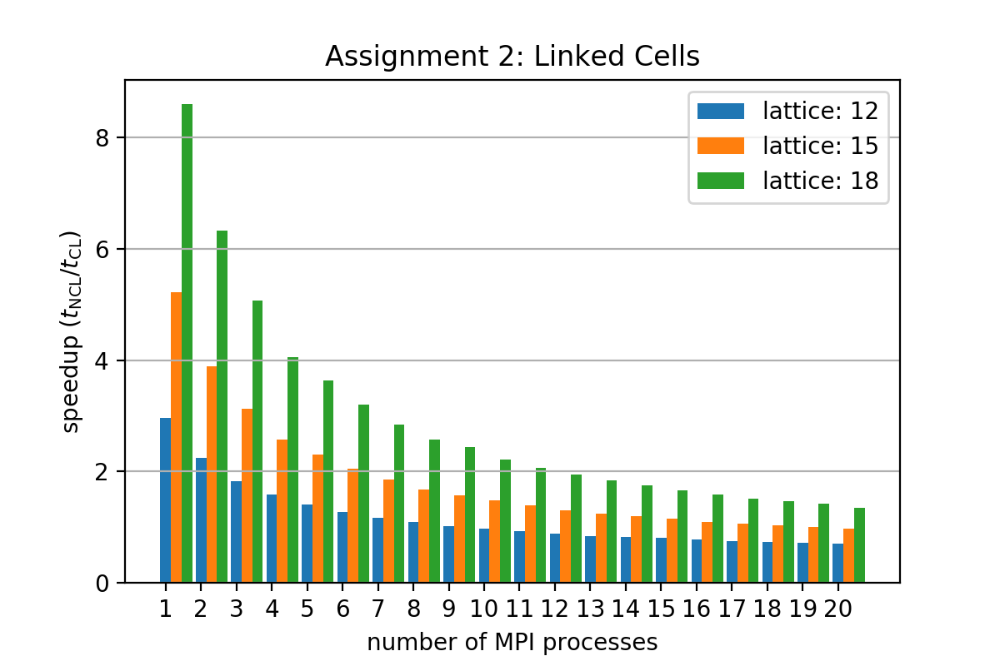
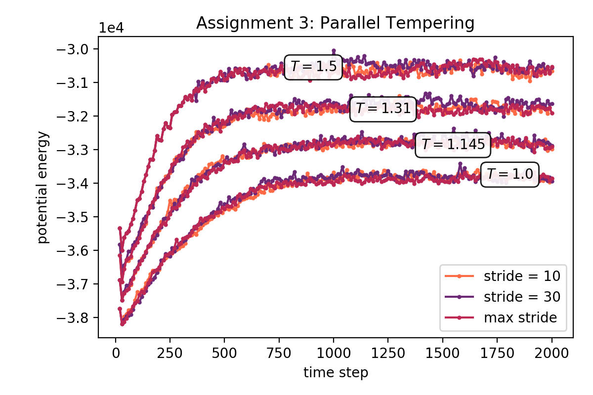

# P2.10 Molecular Dynamics

Teachers: Giovanni Bussi and Sabine Reisser

Student: James N. Vance

Assignment 1 - Parallelize force calculation
============================================

TASK A
------

[[code]](./src/simplemd.cpp#L323)
```c
void compute_forces(...){
    ...

    for(int iatom=myrank;iatom<natoms-1;iatom+=nprocs){

        ...

    }

    MPI_Allreduce(MPI_IN_PLACE, &forces[0][0], 3*natoms, MPI_DOUBLE, MPI_SUM, comm);
    MPI_Allreduce(MPI_IN_PLACE, &engconf, 1, MPI_DOUBLE, MPI_SUM, comm);
}
```

TASK B
------

[[code]](./src/simplemd.cpp#L269)
```c
void compute_list(...){
    list.assign(natoms/nprocs+1,vector<int>());
    for(int iatom=myrank;iatom<natoms-1;iatom+=nprocs)
        for(int jatom=iatom+1;jatom<natoms;jatom++){

            ...

            list[iatom/nprocs].push_back(jatom);
        }
}
```

Results
-------

The following plots show the speedup in total run-time and efficiency relative to the serial case (1 MPI process) with increasing number of MPI processes.
Both plots show that scalability improves as the `lattice` parameter is increased and more particles are evolved.




Assignment 2 - Code Linked cells
================================


[[code]](./src/simplemd.cpp#L234)
```c
#define INDEX(i0,i1,i2,n) (i0 * n[1] + i1) * n[2] + i2

void compute_cells(const int natoms, const double cell[3], const double listcutoff){

    ...

    // Calculate index of neighboring domains
    neighbors.resize(totdomains);
    for (int i0 = 0; i0 < ndomains[0]; ++i0)
      for (int i1 = 0; i1 < ndomains[1]; ++i1)
        for (int i2 = 0; i2 < ndomains[2]; ++i2){

          int mydomain = INDEX(i0,i1,i2,ndomains);

          for (int d0=-1; d0<=+1; ++d0)
            for (int d1=-1; d1<=+1; ++d1)
              for (int d2=-1; d2<=+1; ++d2){
                int neighbor = INDEX( modulo(i0+d0,ndomains[0]),
                                      modulo(i1+d1,ndomains[1]),
                                      modulo(i2+d2,ndomains[2]),
                                      ndomains);
                assert(neighbor >= 0 && neighbor < totdomains);
                neighbors[mydomain].push_back(neighbor);
              }
        }
}
```


[[code]](./src/simplemd.cpp#L269)
```c
void compute_list(...){
    ...

    #ifdef _CELL_LIST

    list.assign(natoms,vector<int>());
    // Recalculate cell list
    vector<vector<int> > domain(totdomains);
    int i[3];
    for (int iatom = 0; iatom < natoms; ++iatom){
      for(int k=0;k<3;k++) i[k] = modulo((int)floor(positions[iatom][k]/dcell[k]),ndomains[k]);
      domain[INDEX(i[0],i[1],i[2],ndomains)].push_back(iatom);
    }
    ...
}
```

Results
-------

The following plots show the speedup in total run-time and efficiency relative to the serial case (1 MPI process) with increasing number of MPI processes.
Both plots show that scalability is poor with this naive implementation of cell lists.


In the following figure, we plot the speedup with respect to the implementation without cell lists obtained in Assignment 1.
We see improvement in the timing for lower number of MPI processes and bigger number of particles.




Assignment 3 - Parallel tempering
=================================

For auto-generating parameter files: [gen_input.py](./input/gen_input.py)


[[code]](./src/simplemd.cpp#L480)
```c
  int parallel_tempering(...)
  {
    int swap = 0;         // store result of metropolis check (0 or 1)
    double ET_buf[2];     // buffer for energy and temperature exchanges

    // perform parallel tempering on master processes only
    if (myrank == 0)
    {

      if ( irep > partner ) // process of higher rank sends data to lower rank
      {
        ET_buf[0] = engconf;
        ET_buf[1] = temperature;

        MPI_Send(ET_buf, 2, MPI_DOUBLE, partner, istep+nstep, comm_col);

        // metropolis check performed in lower-ranked process

        MPI_Recv(&swap, 1, MPI_INT, partner, istep+2*nstep, comm_col, MPI_STATUS_IGNORE);
      }
      else // lower-ranked partner performs the metropolis check
      {

        MPI_Recv(ET_buf, 2, MPI_DOUBLE, partner, istep+nstep, comm_col, MPI_STATUS_IGNORE);

        // check metropolis criterion
        double acc = (1.0/temperature - 1.0/ET_buf[1])*(engconf-ET_buf[0]);
        if (acc > 0)                        swap = 1;
        else if (exp(acc) > random.U01())   swap = 1;

        MPI_Send(&swap, 1, MPI_INT, partner, istep+2*nstep, comm_col);
      }
    }

    vector<Vector> buffer(natoms);

    // Broadcast the result of metropolis step
    MPI_Bcast(&swap, 1, MPI_INT, 0, comm);

    // swap particle positions and velocities
    if(swap==1){
      // put positions in a buffer
      buffer = positions;

      // send positions buffer and receive positions
      MPI_Sendrecv( &buffer[0][0],    3*natoms, MPI_DOUBLE, partner, 20*nstep+istep,
                    &positions[0][0], 3*natoms, MPI_DOUBLE, partner, 20*nstep+istep,
                    comm_col, MPI_STATUS_IGNORE);

      // put velocities in a buffer
      buffer.clear();
      buffer = velocities;

      // send velocities buffer and receive velocities
      MPI_Sendrecv( &buffer[0][0],     3*natoms, MPI_DOUBLE, partner, 40*nstep+istep,
                    &velocities[0][0], 3*natoms, MPI_DOUBLE, partner, 40*nstep+istep,
                    comm_col, MPI_STATUS_IGNORE);

      // send and receive temperatures for rescaling
      MPI_Sendrecv(&temperature, 1, MPI_DOUBLE, partner, istep+50*nstep,
                   &ET_buf[1],   1, MPI_DOUBLE, partner, istep+50*nstep, comm_col, MPI_STATUS_IGNORE);

      // rescale velocities accordingly
      double factor = sqrt( temperature / ET_buf[1] );
      for(int iatom=0;iatom<natoms;iatom++) for(int i=0;i<3;i++) velocities[iatom][i] *= factor;
    }

    return swap;
  }
```


Results
-------

To verify that the parallel tempering implementation is working correctly, we look at the potential energy for different values of the exchange stride. A low value means frequent exchanges, while the max value which exceeds nsteps means no exchanges occur. We see that we get relatively the same potential energy for each replica.



We also look at the behaviour of the acceptance ratio of the swaps with respect to the size of the system. We see that as the system size increases, the Metropolis criterion accepts the swaps even less.


